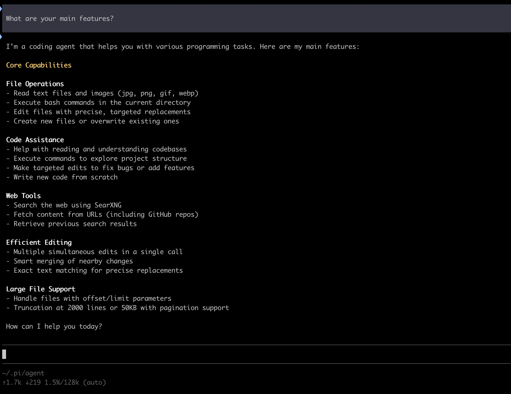
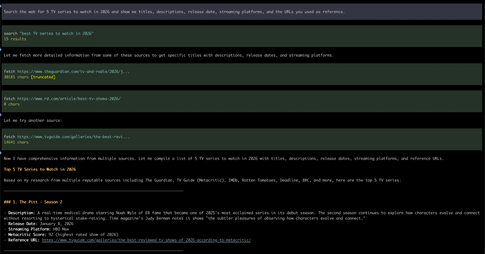

# Run a Web agent with pi and llamafile

This is a relatively simpe example of a Web agent, that has search + fetch capabilities. You won't have to write any code for it, but a few installation and configuration steps are required. At the end of this exercise, you will be able to use pi to help you search for information on the Web, download web pages, and process their contents.

## References
- Pi: https://pi.dev/
- SearXNG website: https://docs.searxng.org/
- SearXNG instances (if you don't want to install your own): https://searx.space/ (note, however, that most of them do not expose their JSON API, which is required to work with agents)
- [llamafile 0.10](https://huggingface.co/mozilla-ai/llamafile_0.10)
- [Docker](https://docs.docker.com/get-started/get-docker/) (you will need this if you want to easily run searxng locally)

## Install SearXNG
I have been following the instructions available [here](https://docs.searxng.org/admin/installation-docker.html#manual-instancing) which boil down to:

```
# Create directories for configuration and persistent data
$ mkdir -p ./searxng/config/ ./searxng/data/
$ cd ./searxng/

# Run the container
$ docker run --name searxng -d \
    -p 8888:8080 \
    -v "./config/:/etc/searxng/" \
    -v "./data/:/var/cache/searxng/" \
    docker.io/searxng/searxng:latest
```

After that, you should be able to connect to your local SearXNG instance by opening http://localhost:8888/ in your browser.

Note that the default configuration does not allow to return JSON, which is essential for the API to work. After starting the docker image, a configuration file is created in the `config` directory. So:

- stop and remove the currently running container with `docker stop searxng && docker rm searxng`
- edit the configuration file (e.g. `vi config/settings.yaml`) and search for "json", then change the following section

```
  # remove format to deny access, use lower case.
  # formats: [html, csv, json, rss]
  formats:
    - html
```
so that it also includes a line with `-json`

- finally, restart the container with the `docker run ...` command above

## Install Pi

There are different ways to install Pi (see [its website](https://pi.dev/) for more info). The one I found simplest is:

```
curl -fsSL https://pi.dev/install.sh | sh
```

## Configure pi to run with a llamafile

After you run pi for the first time, it will create a directory `~/.pi/agent` holding some downloaded tools and configurations. Create a new `models.json` file and paste the following content inside it:

```
{
  "providers": {
     "llamafile": {
         "baseUrl": "http://localhost:8080/v1",
         "api": "openai-completions",
         "apiKey": "whatever",
         "compat": {
           "supportsDeveloperRole": false,
           "supportsReasoningEffort": false
         },
         "models": [
           { "id": "llamafile" }
        ]
     }
  }
}
```

## Run pi with a llamafile
- start llamafile first (for this example, we have downloaded Qwen3.5-9B from https://huggingface.co/mozilla-ai/llamafile_0.10/blob/main/Qwen3.5-9B-Q5_K_S.llamafile so we started it as `./Qwen3.5-9B-Q5_K_S.llamafile`)
- start pi
- ask pi: `What are your main features?`

Pi has access to its own documentation, so it will call the LLM served by llamafile to read it and provide you with a summary.



NOTE: if you want to see what is happening when pi calls llamafile, instead of starting it with no parameters you can run it as

```
./Qwen3.5-9B-Q5_K_S.llamafile --server
```

This will show all calls hitting the server, how many tokens are used for each, and how fast (tokens/sec) the model is replying.

## Install the SearXNG extension for pi

Run the following command:
```
pi install npm:pi-searxng
```

Then create the file `~/.pi/searxng.json` with the following configuration:

```
{
  "searxngUrl": "http://localhost:8888",
  "timeoutMs": 30000,
  "maxResults": 10
}
```

## Run pi with llamafile and searxng

- restart pi
- ask a question that requires searching the Web for you, e.g. ` Search the web for 5 TV series to watch in 2026 and show me titles, descriptions, release date, streaming platforms, and the URLs you used as reference.`
- pi will call the `search` and `fetch`  tools repeatedly, until it has all the information it needs to answer your question

NOTE that while preparing its answer by adding new Web pages to its context, pi might use all the LLM context made available and reply with an `Error: Context size has been exceeded.`
This is expected, because by default llamafiles start with a context of just 16384 tokens, which can be reached quite easily. To address this, restart llamafile by using a larger context size, e.g.

```
./Qwen3.5-9B-Q5_K_S.llamafile --ctx-size 40000
```

or
```
./Qwen3.5-9B-Q5_K_S.llamafile --ctx-size 0
```

(this will use the maximum size available for the specific model, which is 262144 for Qwen3.5-9B).



The conversation trace for this example is available [here](assets/pi_trace.jsonl)